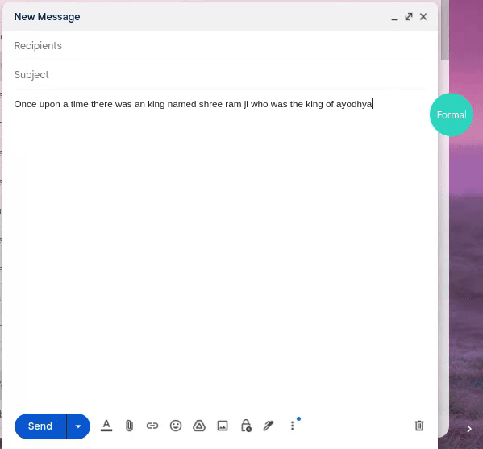

# Formally AI Chrome Extension

<p align="center">
  
</p>
<p align="center">
  
</p>

Formally AI is a Chrome extension that leverages a simple AI language model to make your text more formal and refined.

## Features
- Quickly transform text to a formal and polished style.

## Installation

### Manual Installation:

1. **Download Extension:**
   Download the extension source code as a ZIP file and extract it to a folder on your computer.

2. **Set Up API Key:**
   Follow the API Key Setup guide below to set up your OpenAI API key.

3. **Load the Extension:**
   - Open the Chrome browser.
   - Go to `chrome://extensions/`.
   - Enable "Developer mode" in the top right corner.

4. **Load Unpacked:**
   - Click on "Load unpacked" in the top left corner.
   - Select the folder where you extracted the extension source code.

5. **Use the Extension:**
   - Once loaded, you'll see the extension icon in the toolbar.
   - It should automatically start working after installation.

## API Key Setup

To use this extension, you need to set up your OpenAI API key.

1. Sign up for an account on [OpenAI](https://openai.com/).
2. Create a new project to get your API key.
3. Open the `background.js` file in the extension's directory.
4. Find the `OPENAI_API_KEY` variable at the top and replace `YOUR_API_KEY` with your actual OpenAI API key.

```javascript
// background.js

const OPENAI_API_KEY = 'YOUR_API_KEY'; // Replace with your OpenAI API key
